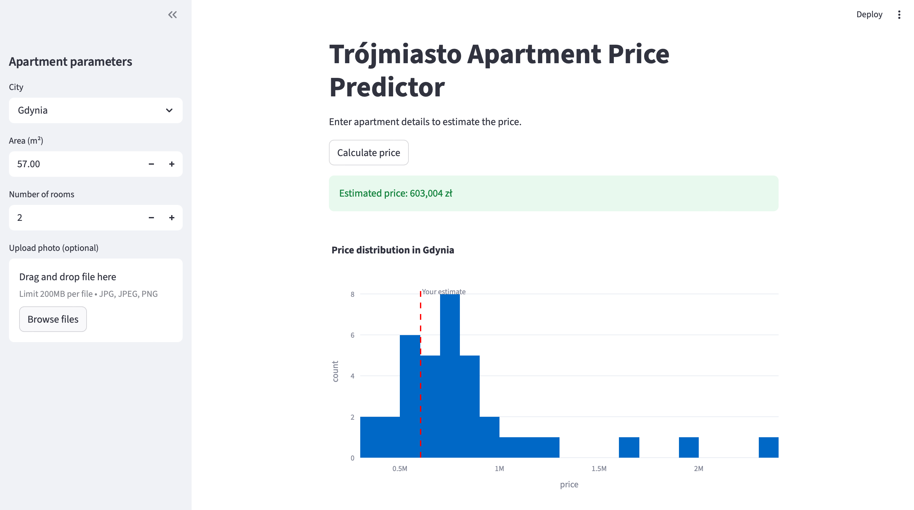

# Trójmiasto Apartment Price Predictor

## Description
This project implements a full pipeline for predicting apartment prices in Trójmiasto (Gdańsk, Gdynia, Sopot): from data scraping to a web application.

## How to Run

1. Install dependencies:
   ```
   pip install -r requirements.txt
   ```

2. Run the following scripts in order:
   ```
   python3 scraper.py
   python3 clean_trojmiasto.py
   python3 analysis.py
   python3 model_trojmiasto.py
   ```

3. Launch the web app:
   ```
   streamlit run app.py
   ```

## Project Structure
- `scraper.py` — data scraping
- `clean_trojmiasto.py` — data cleaning and preparation
- `analysis.py` — data analysis and visualization
- `model_trojmiasto.py` — model training and saving
- `app.py` — Streamlit web application
- `data/` — data files
- `plots/` — generated plots

## Example


---

## Author
Evgeny Podskrebkin, 2026
