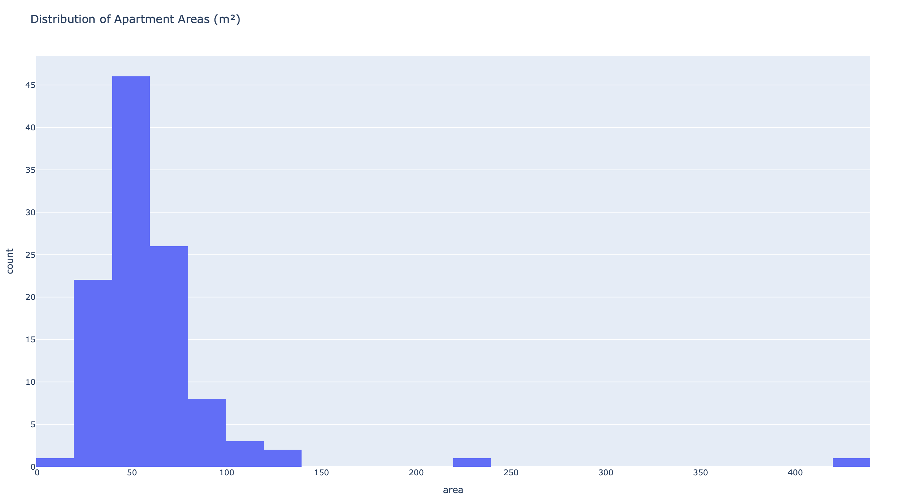
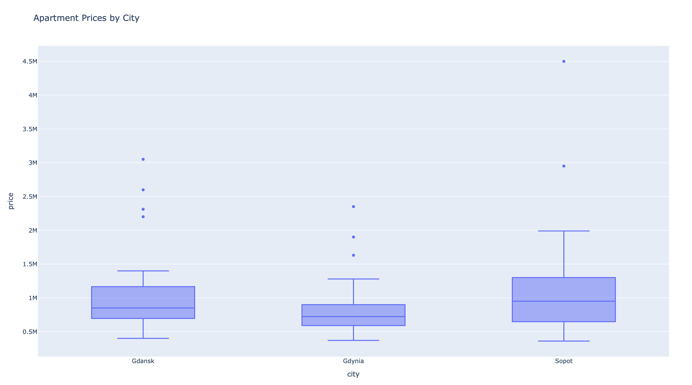
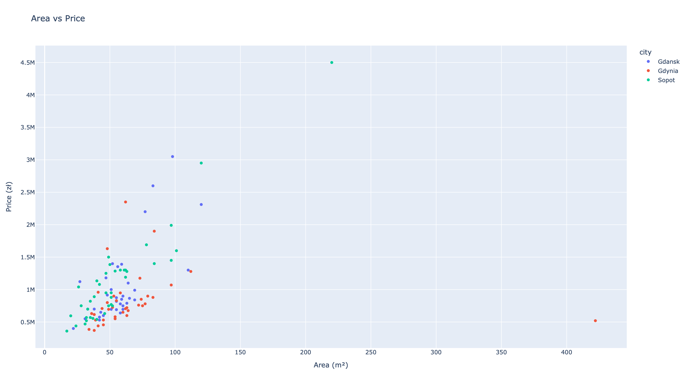
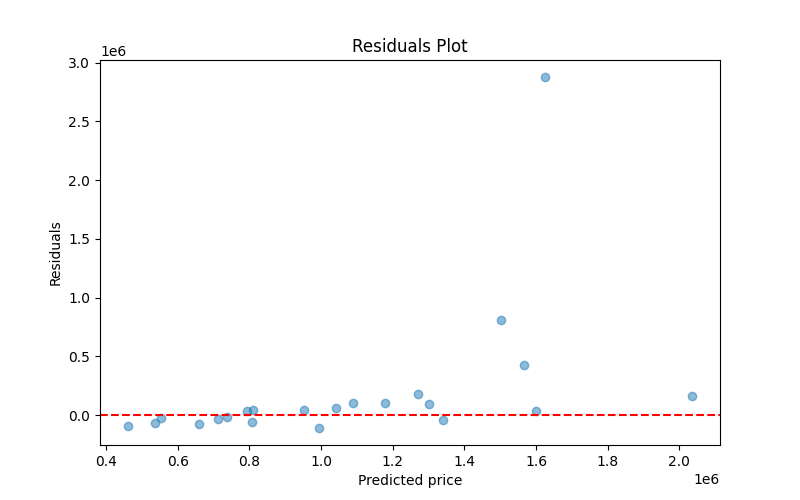

# Trójmiasto Apartment Price Prediction — Report

**Author:** Evgeny Podskrebkin  
**Date:** March 2026

---

## 1. Project Overview
This project demonstrates a complete machine learning pipeline for predicting apartment prices in Trójmiasto (Gdańsk, Gdynia, Sopot). The workflow includes data scraping, cleaning, analysis, model training, and deployment as a web application.

## 2. Data Description
- **Source:** adresowo.pl (scraped in March 2026)
- **Number of records:** 595 
- **Main features:** city, area (m²), number of rooms, price, price per m², etc.

## 3. Key Visualizations
- **Histogram of apartment areas**
  
  
  
  _Shows the distribution of apartment sizes._

- **Boxplot of prices by city**
  
  
  
  _Compares price ranges in Gdańsk, Gdynia, Sopot._

- **Scatter plot: Area vs Price**
  
  
  
  _Visualizes the relationship between area and price._

## 4. Model Results
- **Algorithm:** RandomForestRegressor
- **R² score:** 0.4605
- **Residuals plot:**
  
  

## 5. Web Application
- The Streamlit app allows users to enter apartment parameters and get a price estimate with a comparison to the market.
- Example screenshot:
  
  

## 6. Conclusions
- The model provides reasonable price estimates for apartments in Trójmiasto.
- The pipeline is fully automated and can be easily updated with new data.

---
